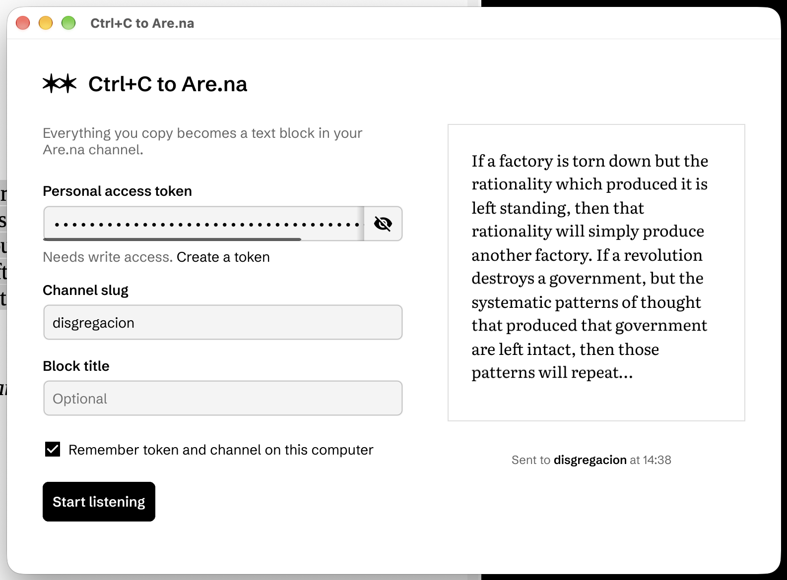

# Ctrl+C 2 Are.na

Simple `Go` utility that monitors the Clipboard. Whenever you `Ctrl+C` it sends the copied text to the specified channel in your Are.na profile.



## Things you need to run/develop the source code:

- `Go` (https://go.dev/).
- An Are.na account.
- An Are.na personal access token with the `write` scope (https://www.are.na/settings/personal-access-tokens). The app uses the [Are.na API v3](https://www.are.na/developers/explore).
- The slug of the channel you want to feed (as of `https://www.are.na/{your-profile}/{your-channel}`).

Inside the folder execute in the console `go run .`

## Where your token is stored

Nothing is saved unless you tick **"Remember token and channel on this computer"** before starting. When you do, the token and the channel slug are stored separately:

**The token goes into your operating system's password manager.** It is never written to a file by this app, and the app does not encrypt it itself — the operating system does, tied to your user login. This is the same place browsers and other apps keep their passwords.

| System  | Where the token is kept                                                                                                                                    | How to see or delete it                                          |
| ------- | ---------------------------------------------------------------------------------------------------------------------------------------------------------- | ---------------------------------------------------------------- |
| macOS   | Login keychain, as a password item named **"Ctrl+C to Are.na"** (account `personal-access-token`)                                                          | Open **Keychain Access** and search for "Ctrl+C"                 |
| Windows | **Credential Manager**, under Windows Credentials, as `Ctrl+C to Are.na:personal-access-token`                                                             | Control Panel → Credential Manager → Windows Credentials         |
| Linux   | The **Secret Service** keyring (GNOME Keyring, KWallet, or similar), as a secret labelled **"Password for 'personal-access-token' on 'Ctrl+C to Are.na'"** | Seahorse ("Passwords and Keys") or your desktop's wallet manager |

macOS might not ask you for permission when the app saves the token; the item simply appears in your login keychain.

On Linux, a Secret Service daemon must be running. If there isn't one, the app still works but shows a red note under "Listening" saying the token couldn't be remembered, and you'll have to enter it again next time. It will not fall back to a plain-text file.

**Only the channel slug goes into a file**, readable by your user account alone:

- macOS: `~/Library/Application Support/ctrlc2arena/settings.json`
- Windows: `%AppData%\ctrlc2arena\settings.json`
- Linux: `~/.config/ctrlc2arena/settings.json`

The file contains just `{"slug":"your-channel"}`; the token is never in it.

**To forget everything**, untick the checkbox and press "Start listening" once. The app removes the token from the password manager and deletes the settings file. You can also delete the keychain item by hand using the table above.

**Upgrading from an older version:** earlier releases saved the token in plain text in a file called `arena_settings.json` next to the app. On first launch, the new version moves its contents into the storage described above and deletes that file. If the token can't be moved (for example, no keyring on Linux), the old file is left untouched so nothing is lost — delete it by hand once you've re-entered the token.

### Final executables

Here is the Windows .exe file: https://github.com/animanoir/CtrlC_2_Are.na/releases/tag/release

I'll add soon the Mac/Linux apps (or if anyone wants to do it feel free).

## Build

`go build` automatically detects your current operating system and architecture to build for that target by default. However, Go also supports cross-compilation, allowing you to build for different platforms by setting the `GOOS` and `GOARCH` environment variables.

For Windows, this command should work: `go build -ldflags="-H=windowsgui" -o ctrl2arena.exe`

For cross-compilation examples:

```bash
# Build for Windows from any OS
GOOS=windows GOARCH=amd64 go build -ldflags="-H=windowsgui" -o ctrl2arena.exe

# Build for Linux
GOOS=linux GOARCH=amd64 go build -o ctrl2arena

# Build for macOS
GOOS=darwin GOARCH=amd64 go build -o ctrl2arena
```

You can see all supported target combinations with: `go tool dist list`

## Use case

I like to read and collect information in my Are.na from books and stuff. I also find tedious to copy/paste it each time. So now this tool automatically does it for me, and I can save important notes outside my main computer. This has made my research easier and funnier.

## Collaboration

Please, feel free to fork and enhance the current code so it becomes easier and beautiful to use!


---

Built with ❤️ using Go and the Are.na API
